

## Аннотация
Проект посвящен обучению нескольких сверточных нейросетей детектировать лица людей на фотографиях. Были взяты три модели из фреймворка torchvision.models.detection: FasterRCNN, SSD и RetinaNet. 
Обучение проводилось на датасете WIDER FACE http://shuoyang1213.me/WIDERFACE/ (в тренировочной выборке 12876 фото, валидационной 3222 фото). 
Backbone модели выбран обученным на Image Net. Головы, отвечающие за регрессию и классификацию, выбраны необученными.  Несколько последних слоев backbone, регрессор и классификатор были оставлены обучаемыми, остальные слои были заморожены.
При обучении контролировались метрики Precision, Recall, F1 и для итоговой оценки качества модели Average precision. Использование RetinaNet c двумя тренируемыми слоями backbone показало наилучший результат Average precision=0.7393.

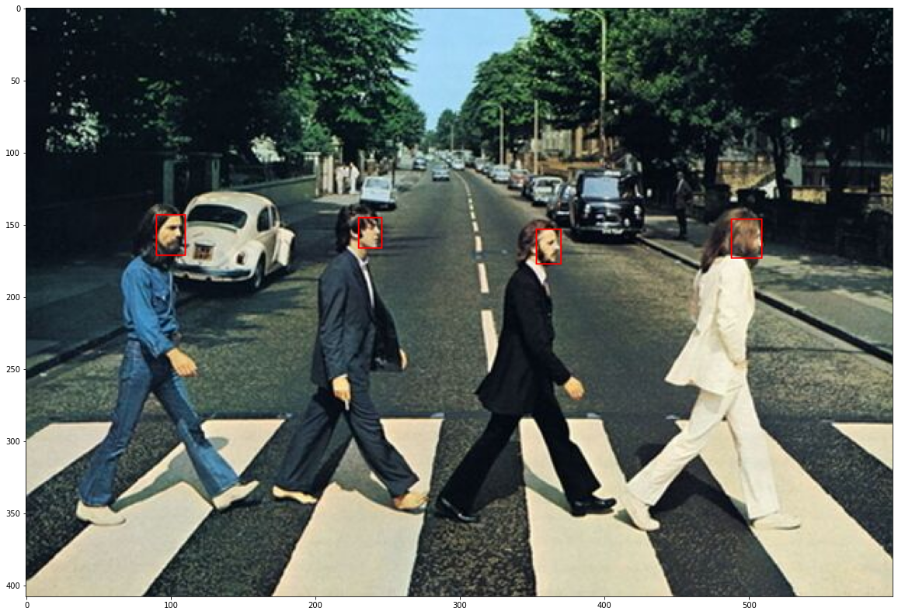
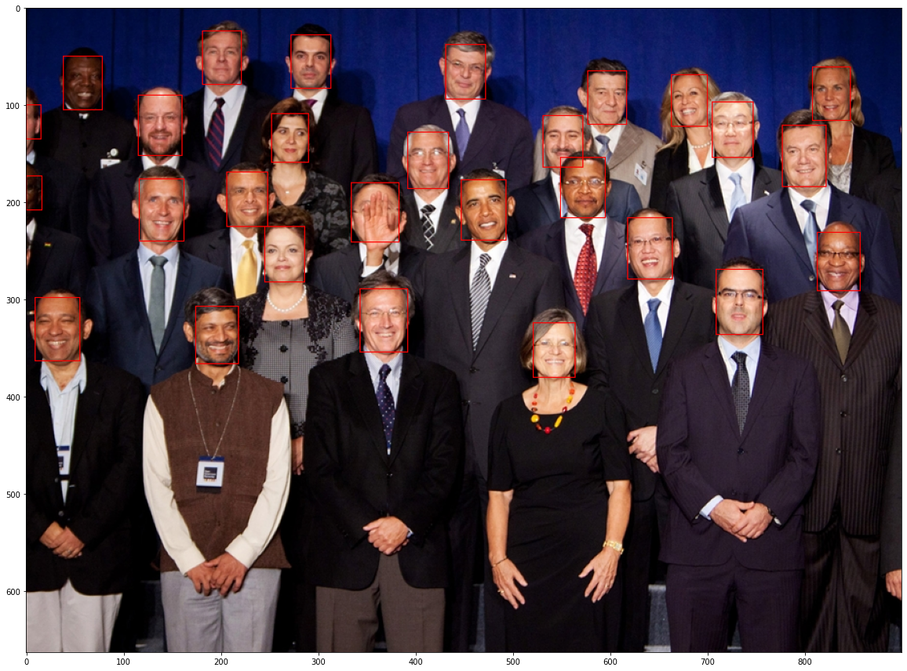
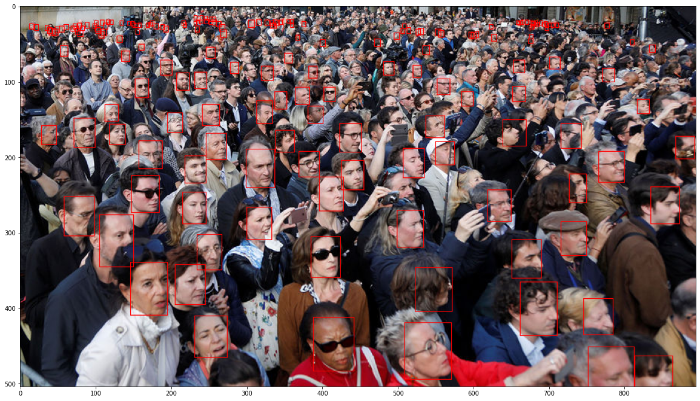

Рис.0 Демонстрация работы обученной RetinaNet.

## Процесс обучения
Будем выводить графики лосса на train и трех метрик. Метрики вычисляются раз в 10 батчей, поэтому точек по горизонтали в 10 раз меньше, чем у лосса. Графики метрик на train вычислены без фильтрации по порогу, а на val с фильтрацией. Это сделано для наглядной демонстрации улучшения качества после фильтрации.

Видим, что график лосса, приведенный на train, несет мало информации, так как после небольшого участка резкого падения в самом начале, далее он практически не меняется. Но обучение при этом идет, что видно на графиках метрик. Поэтому приведение лосса на val выборке не имеет особого смысла. Тем более, это требует дополнительного запуска модели в train режиме, что увеличило бы время обучения.

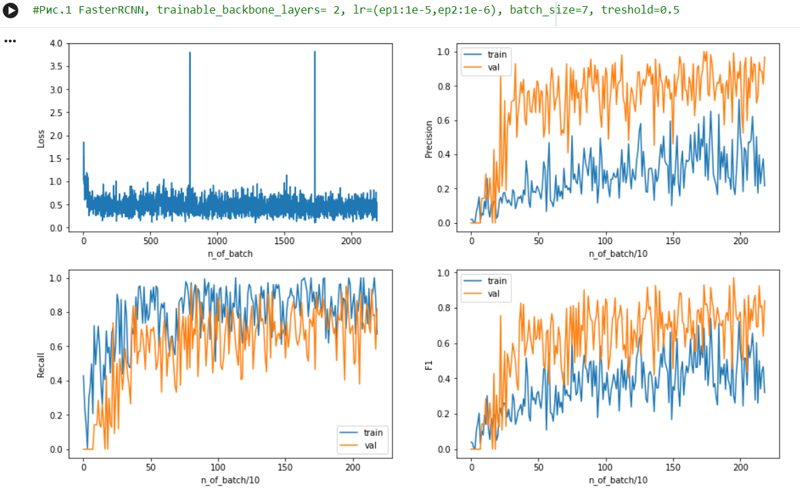
На Рис.1 полученные графики метрик очень зашумлены, что затрудняет анализ. Применим процедуру сглаживания.
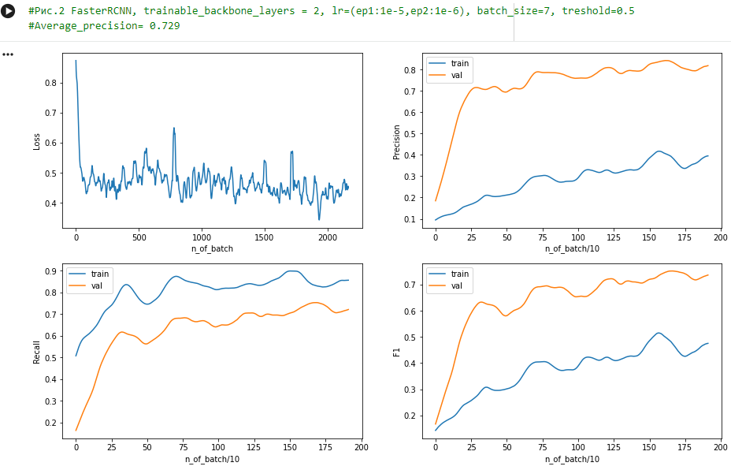
На Рис.2 представлены сглаженные графики метрик для FasterRCNN. Графики для val приведены после фильтрации по порогу уверенности бокса. Это удаляет большинство false positive боксов, поэтому желтая кривая для precision идет значительно выше синей. Но фильтрация также может удалить true positive боксы, поэтому кривая для recall опускается.

Две метрики precision и recall не чувствительны к false negative и false positive соответственно. Поэтому они не дают полную оценку качества модели и вводится метрика F1, которая зависит от баланса между precision и recall. Выбор оптимального порога позволяет достичь максимальной F1. На данном рисунке порог не оптимален, т.к. precision превышает recall.

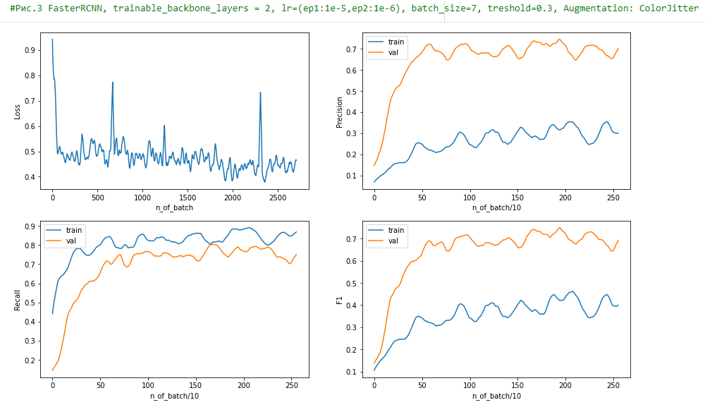

На Рис.3 понижен порог фильтрации, что улучшает баланс между precision и recall. Применяется аугментация картинок путем случайного изменения яркости, контраста и насыщенности (преобразования, не меняющие координат боксов). Сравнивая Рис.2 и 3, можно заключить, что такая аугментация не дает повышения F1 меры на val выборке.

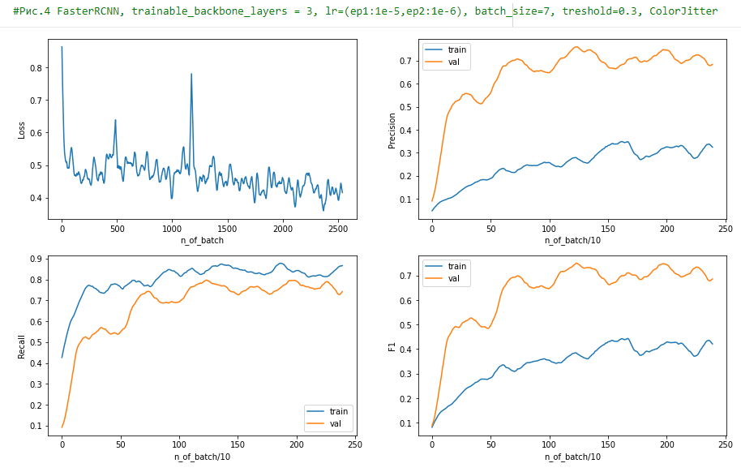

На Рис.4  увеличили количество обучаемых слоев backbone сети (для FasterRCNN это ResNet50) до 3-х. Видим, что это не приводит к существенным изменениям в метриках.

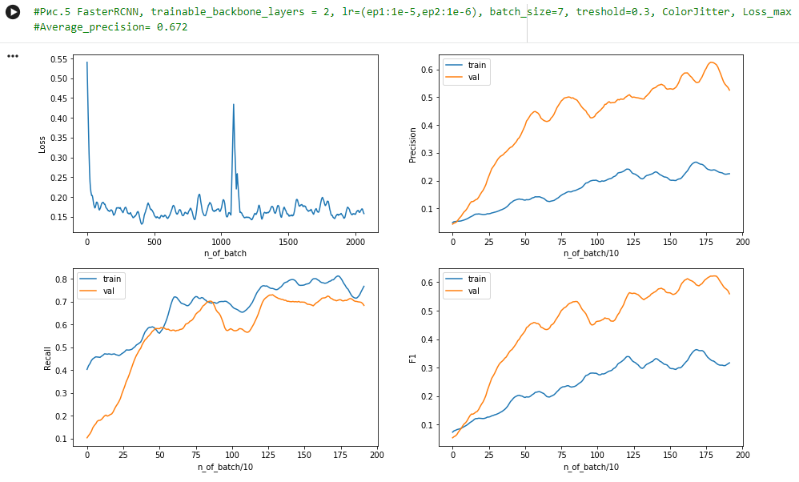

В предыдущих случаях для обучения использовался лосс в виде суммы лоссов регрессии и классификации, выдаваемых моделью. Попробуем задать лосс, как максимальне значение из этих слагаемых (Рис.5). Видно, что при этом модель обучается медленнее, само значение лосса при выходе на плато меньше. Но метрики достигают меньших значений.

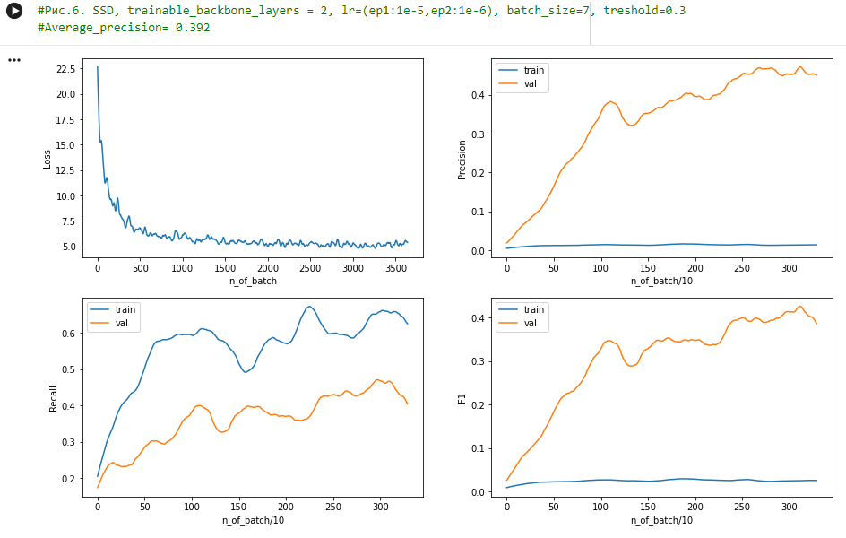

Тренировка SSD на двух эпохах (Рис.6) показала неудовлетворительный результат, AP = 0.392. Precision на train имеет очень низкие значения, так как сеть выдает очень много false positive. Установление порога фильтрации боксов по уверенности повышает метрику, но итоговое качество значительно ниже, чем у FasterRCNN и RetinaNet.

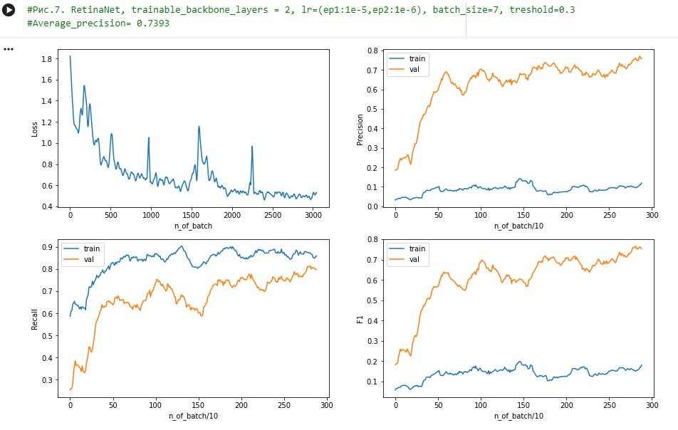

Использование RetinaNet c двумя тренируемыми слоями backbone показало наилучший результат AP=0.7393 (Рис.7).

Интересно при этом сравнить графики лосса для FasterRCCN и RetinaNet. У FasterRCCN имеется резкое падение в начале и далее очень пологое уменьшение. У RetinaNet график идет более плавно.

Еще можно отметить, что график Precision и F1 меры на train выборке для RetinaNet достигает меньших значений, чем для FasterRCNN. А график Recall наоборот, больших. Это объясняется тем, что в отсутствие порога фильтрации RetinaNet выделяет больше боксов, среди которых есть true positive и false positive.

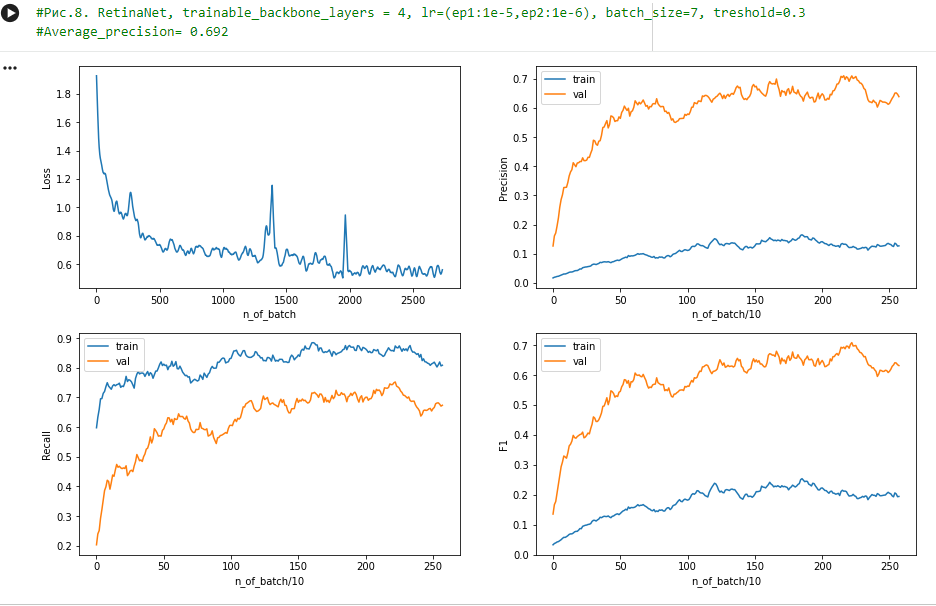

Увеличение числа обучаемых слоев backbone RetinaNet с 2 до 4 привело к ухудшению результата (Рис.8).

## Замеченые причины ошибок

1. лицо видно не полностью

2. слишком мелкие лица

3. false positive на посторонних объектах

4. некоторые перевернутые лица

5. картинки низкого качества

6. замечены случаи, когда сеть замечает то, чего не отмечено в разметке

Все эти ошибки можно корректировать изменением порога фильтрации уверенности боксов.

